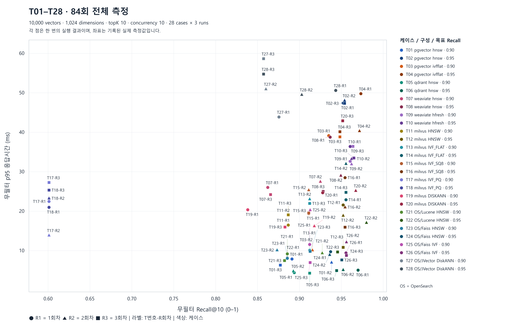

# T01–T28 벡터 검색 비교 결과 — 2026-09-11
> 현재 결과는 [전체 sweep 372개 실측 보고서](sweep-results-20260911.md)입니다.
>
> 역사 자료: 이 84개 결과는 목표별로 선택한 파라미터를 측정한 과거 프로토콜이다. 현재의 전체 검색 파라미터 sweep 결과가 아니다. [현재 프로토콜](../03-benchmark-design/current-protocol.md)을 적용한 새 측정과 구분한다. 원본 수치를 유지해 X=p95·Y=Recall로 다시 그린 [산포도 SVG](assets/matrix-20260911/scatter-recall-latency-all-84.svg) · [PNG](assets/matrix-20260911/scatter-recall-latency-all-84.png)에는 84개 실측과 0.90·0.95 수평 참고선이 모두 포함된다.

이 문서는 2026년 9월 11일 **18:48:20~19:39:20(KST)**에 실행한 T01–T28의 결과다. 14개 DB·엔진·인덱스 조합에 목표 Recall 0.90과 0.95를 각각 적용하고, 전체 인덱스를 세 번 재구축했다. **42회 재구축, 84개 실행 결과, 본 측정 검색 84,000회**를 완료했다.

비교 단위는 **DB·엔진·인덱스와 목표 Recall로 구분한 28개 케이스**다. 모든 케이스를 그대로 기록하고 검색 정확도·응답시간·처리량·자원 사용·재구축에 따른 변동을 비교한다.

- [84회 개별 실행 기록과 검색 파라미터](matrix-runs-20260911.md)
- [전체 측정 CSV](assets/matrix-20260911/vector-db-result.csv)
- [산포도 PNG](assets/matrix-20260911/scatter-all-84.png) · [산포도 SVG](assets/matrix-20260911/scatter-all-84.svg)

## 1. 이번 실행에서 확인한 내용

<!-- BEGIN OBSERVATIONS -->

- 목표 ±0.01 범위에 들어온 실행은 **26/84회**다. 목표 0.90에서는 3/42회, 목표 0.95에서는 23/42회였다.
- 목표 범위에 세 회차 모두 들어온 케이스는 **T02, T12, T14, T16, T26**다. 이 목록은 목표 일치 여부를 설명하며 제품 선정 목록이 아니다.
- Qdrant T05·T06은 이번 측정에서 낮은 p95를 기록했다. 다만 T06 Recall은 0.9444~0.9700이므로 평균 수치와 각 실행의 정확도를 함께 봐야 한다.
- Milvus IVF_PQ T17·T18의 여섯 실행은 모두 Recall 0.6011이었다. JVector T28은 같은 검색 파라미터를 사용해도 재구축 회차에 따라 Recall이 달라졌다.
- 84개 점을 모두 표시한 산포도와 개별 실행값을 보존했다. 가까운 점도 평균으로 합치거나 삭제하지 않았다.

| 목표 Recall | 범위 안 | 범위보다 아래 | 범위보다 위 | 합계 |
|---|---:|---:|---:|---:|
| 0.90 | 3 | 18 | 21 | 42 |
| 0.95 | 23 | 11 | 8 | 42 |

<!-- END OBSERVATIONS -->

목표 범위를 맞춘 횟수는 같은 정확도 지점에서 비교하기 위한 정보다. Recall이 목표보다 높아서 범위를 벗어난 결과와 낮아서 벗어난 결과를 구분해야 한다. 또한 p95가 작은 케이스라도 실제 Recall이 다르면 동일한 검색 품질에서 더 빠르다고 단정할 수 없다.

## 2. 케이스 구성

각 행의 두 케이스는 **한 회차에서 동일하게 구축된 인덱스**를 공유한다. 검색 폭 파라미터를 목표별로 선택한 뒤 평가한다. `T01-R1`은 T01 케이스의 첫 번째 재구축 회차를 뜻한다.

<!-- BEGIN MATRIX -->

| 목표 0.90 | 목표 0.95 | DB / 엔진 / 인덱스 | 탐색 폭 파라미터 |
|---|---|---|---|
| T01 | T02 | pgvector / HNSW | `ef_search` |
| T03 | T04 | pgvector / IVFFlat | `probes` |
| T05 | T06 | Qdrant / HNSW | `hnsw_ef` |
| T07 | T08 | Weaviate / HNSW | `ef` |
| T09 | T10 | Weaviate / HFresh | `searchProbe` |
| T11 | T12 | Milvus / HNSW | `ef` |
| T13 | T14 | Milvus / IVF_FLAT | `nprobe` |
| T15 | T16 | Milvus / IVF_SQ8 | `nprobe` |
| T17 | T18 | Milvus / IVF_PQ | `nprobe` |
| T19 | T20 | Milvus / DISKANN | `search_list` |
| T21 | T22 | OpenSearch / Lucene / HNSW | `candidate_k` |
| T23 | T24 | OpenSearch / Faiss / HNSW | `ef_search` |
| T25 | T26 | OpenSearch / Faiss / IVF | `nprobes` |
| T27 | T28 | OpenSearch / JVector / DiskANN | `candidate_k` |

<!-- END MATRIX -->

`Native`는 여기서 별도의 OpenSearch 검색 엔진 구분이 없는 해당 DB의 인덱스 구현을 뜻한다. OpenSearch JVector는 Lucene/Faiss를 쓰는 KNN 플러그인 구성과 별도 이미지·컨테이너로 실행했다.

인덱스 구축 설정은 CSV의 `index_parameters`, 실행 중 탐색 폭 설정은 `search_parameters`에 구분해 기록했다. 예를 들어 pgvector HNSW는 `m=16`, `ef_construction=128`로 구축하고, `ef_search`를 목표별로 선택했다. 각 DB·인덱스의 정의와 준비 절차는 [DB별 구현 문서](../05-databases/)에 설명되어 있다.

## 3. 데이터와 실행 환경

| 항목 | 이번 실행 조건 |
|---|---|
| 코퍼스 | 한국어 합성 기술문서 chunk 10,000개, 기록된 원본 document ID 200개 |
| 벡터 | Ollama로 생성한 BGE-M3 dense 벡터, 1,024차원 |
| 거리 / 검색 개수 | COSINE / topK=10 |
| 질의 | 총 300개. calibration 100개, evaluation 200개로 고정 분리 |
| calibration 구성 | 무필터 90개, 메타데이터 필터 10개. 검색 파라미터 선택에는 무필터 90개 사용 |
| evaluation 구성 | 무필터 180개, 메타데이터 필터 20개 |
| 동시성 / 반복 | concurrency=10, evaluation 워밍업 1회, 본 측정 5회 |
| DB 자원 상한 | 측정 대상 DB 컨테이너 합계 4 vCPU / 8 GiB, 메모리 상한과 swap 포함 상한을 같게 설정 |
| Milvus 자원 배분 | 본체 3 vCPU·6,656 MiB + etcd 0.5 vCPU·512 MiB + MinIO 0.5 vCPU·1,024 MiB |
| 호스트 | Windows 11, 애플리케이션에서 확인한 논리 프로세서 16개, 물리 메모리 약 47.93 GiB |
| Docker | 29.7.2, Docker에서 확인한 CPU 16개·메모리 약 23.43 GiB |
| 애플리케이션 | Java 21.0.11 / Spring Boot 4.1.1 / Gradle 9.7.1 |
| 클라이언트 경로 | pgvector는 JDBC, 나머지 DB의 검색 경로는 Java HttpClient 기반 어댑터 |

숫자 10,000은 원문 10,000개를 다시 청킹했다는 뜻이 아니다. 사전에 생성된 합성 chunk 10,000개를 입력으로 사용했다. 모델·벡터·질의의 해시는 [임베딩 manifest](assets/matrix-20260911/embedding-manifest.json)와 [재현 정보](assets/matrix-20260911/reproduction.json)에 보존했다.

| 구성 | 사용 이미지 또는 버전 |
|---|---|
| pgvector / PostgreSQL | `pgvector/pgvector:0.8.6-pg17-bookworm` |
| Qdrant | `qdrant/qdrant:v1.19.0` |
| Weaviate | `cr.weaviate.io/semitechnologies/weaviate:1.39.3` |
| Milvus | `milvusdb/milvus:v3.0.1` |
| Milvus etcd / MinIO | `v3.5.25` / `RELEASE.2024-05-28T17-19-04Z` |
| OpenSearch Lucene / Faiss | `opensearchproject/opensearch:3.8.0` |
| OpenSearch JVector | `vector-opensearch-jvector:3.8.0`, 플러그인 `3.8.0.0` |

태그만으로 후속 이미지 변경을 구분할 수 없으므로 실제 사용한 8개 이미지의 ID도 [docker-images.json](assets/matrix-20260911/docker-images.json)에 보존했다. OpenSearch와 OpenSearch/JVector의 JVM 힙은 모두 **`-Xms4g -Xmx4g`**였다. 메모리 수치는 이 설정을 포함한 실행 결과다.

## 4. 측정 절차와 지표의 의미

### 4.1 인덱스 재구축과 파라미터 선택

1. DB·엔진·인덱스 조합별로 인덱스를 다시 만들고 벡터를 적재한 다음, 어댑터의 준비 완료 조건을 기다린다.
2. 같은 입력 벡터에 대해 Java `ExactSearchEngine`이 전수 cosine 검색으로 정답 top-10을 계산한다. 필터 질의는 해당 필터를 만족하는 문서 안에서 정답을 구한다.
3. calibration의 무필터 90개 질의로 검색 폭 후보를 측정한다. 후보는 파라미터 값의 오름차순이며, 목표 ±0.01에 들어오는 첫 후보를 선택한다. 범위 안 후보가 없으면 Recall이 목표에 가장 가까운 후보를 선택하고 `CLOSEST_AVAILABLE`로 기록한다. 실제 지연시간이 가장 짧은 후보를 탐색한 것은 아니다.
4. 선택한 파라미터로 evaluation 200개를 워밍업 1회, 본 측정 5회 검색한다. 평가 결과를 보고 파라미터를 다시 선택하지 않는다.
5. 이 과정을 회차별로 재구축해 세 번 반복한다. 순서는 아래와 같으며 같은 DB의 인덱스 그룹도 각각 실행한다.

| 회차 | DB 실행 순서 |
|---|---|
| R1 | pgvector → Qdrant → Weaviate → Milvus → OpenSearch |
| R2 | Weaviate → OpenSearch → pgvector → Qdrant → Milvus |
| R3 | Milvus → Qdrant → OpenSearch → Weaviate → pgvector |

calibration과 evaluation은 질의 유형 비율을 보존하는 SHA-256 규칙으로 나누고, 세 회차 모두 같은 분할을 사용했다. 이 분리는 파라미터 선택에 사용한 질의에서만 정확도가 높게 나오는 효과를 확인하기 위한 것이다. 두 집합의 Recall 차이만으로 같은 질의의 시간상 성능 변화라고 해석할 수는 없다.

### 4.2 결과표의 지표

| 지표 | 계산 대상과 읽는 방법 |
|---|---|
| Recall@10 | exact top-10과 ANN 결과의 일치 정도. 이번 주 비교값은 무필터 evaluation 180개를 5회 검색한 900건의 `comparison_recall` |
| Recall 평균 / 범위 | 케이스별 세 실행의 Recall 평균과 최솟값~최댓값. 개별 실행 3개의 변동을 함께 표시 |
| p95(ms) | 무필터 검색 900건의 응답시간 95백분위. 주 표에서는 세 실행에서 각각 얻은 p95의 중앙값 사용 |
| 혼합 QPS | 필터 포함 evaluation 200개 × 5회 = 1,000건을 완료한 전체 처리량. 무필터 전용 QPS가 아님 |
| peak RAM(MiB) | 실행별 Docker CLI 메모리 표본의 최댓값. 주 표에서는 그 최댓값 3개의 중앙값을 표시. 1 MiB=1,048,576 bytes |
| 목표 범위 안 횟수 | 각 실행의 Recall이 목표 ±0.01에 들어간 횟수. 세 실행의 평균만 범위에 들어간 것과 구분 |

**84회는 서로 다른 질의 집합 84개를 뜻하지 않는다.** 고정 evaluation 200개를 각 케이스에서 5회 검색하므로 본 측정 호출 수가 `28 × 3 × 200 × 5 = 84,000`이다. 튜닝·워밍업·추가 안정성 진단 호출은 여기에 포함하지 않는다.

p95 중앙값은 세 실행의 개별 지연시간을 합쳐 다시 계산한 p95가 아니다. Recall은 의미상 좋은 답변을 찾았는지나 RAG 답변 품질을 직접 평가하는 지표도 아니다. 같은 임베딩에서 exact 검색 결과를 얼마나 재현했는지를 나타낸다.

개별 질의의 Recall@K는 `ANN 상위 K개와 exact 상위 K개에 공통으로 있는 고유 ID 수 / min(K, exact 결과 수)`다. 분모가 0이면 현재 구현은 1.0으로 처리한다. 따라서 필터 질의의 Recall을 해석할 때에는 정답 집합이 비어 있는지도 확인해야 한다. 계산 구현은 [RecallCalculator](../../src/main/java/com/myapp/benchmark/RecallCalculator.java)에 있다.

## 5. 84회 전체 산포도



가로축은 실제 무필터 Recall, 세로축은 무필터 p95(ms)다. 색상은 T01–T28 케이스, 원·삼각형·사각형은 각각 R1·R2·R3을 나타낸다. 모든 점에 `T번호-R회차` 이름을 표시했다. 데이터 좌표를 옮기는 jitter, 평균 집계, 제품 선정 필터는 적용하지 않았다.

같은 Recall에서 아래쪽 점은 p95가 더 작고, 같은 p95에서 오른쪽 점은 Recall이 더 높다. 목표가 다르거나 실제 Recall 차이가 큰 점을 속도 하나로 순위화하지 않는다. 이름이 가까이 모인 구간은 [SVG 원본](assets/matrix-20260911/scatter-all-84.svg)을 확대해 확인할 수 있다.

## 6. 목표 Recall별 28개 결과

표의 수치는 전체 84행 [CSV](assets/matrix-20260911/vector-db-result.csv)에서 케이스별로 계산했다. Recall은 소수점 4자리, p95는 3자리, QPS와 MiB는 1자리로 표시한다. 목표 범위 횟수는 원본의 개별 `target_met`을 사용한다. CSV 자체의 반올림 정밀도와 화면 표시 정밀도는 다르다.

### 6.1 목표 0.90 — 범위 0.89~0.91

<!-- BEGIN TABLE_090 -->

| 케이스 | 구성 | Recall 평균 [최소~최대] | p95 중앙값(ms) | 혼합 QPS 중앙값 | peak RAM 중앙값(MiB) | 목표 범위 안 |
|---|---|---:|---:|---:|---:|---:|
| T01 | pgvector / HNSW | 0.9022 [0.8772~0.9383] | 7.038 | 2203.8 | 192.5 | 1/3 |
| T03 | pgvector / IVFFlat | 0.9330 [0.9156~0.9483] | 38.845 | 1208.9 | 218.4 | 0/3 |
| T05 | Qdrant / HNSW | 0.8996 [0.8928~0.9122] | 4.432 | 3372.5 | 106.9 | 2/3 |
| T07 | Weaviate / HNSW | 0.8843 [0.8622~0.9250] | 26.024 | 688.5 | 189.0 | 0/3 |
| T09 | Weaviate / HFresh | 0.9622 [0.9606~0.9639] | 32.654 | 524.0 | 116.4 | 0/3 |
| T11 | Milvus / HNSW | 0.8867 [0.8867~0.8867] | 19.011 | 1453.2 | 722.7 | 0/3 |
| T13 | Milvus / IVF_FLAT | 0.9122 [0.9122~0.9122] | 21.972 | 1409.3 | 739.6 | 0/3 |
| T15 | Milvus / IVF_SQ8 | 0.9111 [0.9111~0.9111] | 19.542 | 1465.1 | 698.9 | 0/3 |
| T17 | Milvus / IVF_PQ | 0.6011 [0.6011~0.6011] | 22.474 | 1351.8 | 790.8 | 0/3 |
| T19 | Milvus / DISKANN | 0.8796 [0.8383~0.9178] | 16.254 | 836.6 | 650.7 | 0/3 |
| T21 | OpenSearch / Lucene / HNSW | 0.8983 [0.8822~0.9272] | 9.192 | 1667.1 | 4783.1 | 0/3 |
| T23 | OpenSearch / Faiss / HNSW | 0.8906 [0.8733~0.9128] | 9.823 | 1648.9 | 4849.7 | 0/3 |
| T25 | OpenSearch / Faiss / IVF | 0.9126 [0.9122~0.9128] | 11.571 | 1486.8 | 4893.7 | 0/3 |
| T27 | OpenSearch / JVector / DiskANN | 0.8643 [0.8572~0.8756] | 50.965 | 680.9 | 4833.3 | 0/3 |

<!-- END TABLE_090 -->

### 6.2 목표 0.95 — 범위 0.94~0.96

<!-- BEGIN TABLE_095 -->

| 케이스 | 구성 | Recall 평균 [최소~최대] | p95 중앙값(ms) | 혼합 QPS 중앙값 | peak RAM 중앙값(MiB) | 목표 범위 안 |
|---|---|---:|---:|---:|---:|---:|
| T02 | pgvector / HNSW | 0.9533 [0.9522~0.9539] | 47.414 | 951.5 | 195.6 | 3/3 |
| T04 | pgvector / IVFFlat | 0.9644 [0.9483~0.9733] | 40.358 | 1151.3 | 219.4 | 1/3 |
| T06 | Qdrant / HNSW | 0.9556 [0.9444~0.9700] | 5.064 | 3016.6 | 107.9 | 2/3 |
| T08 | Weaviate / HNSW | 0.9381 [0.9283~0.9494] | 29.053 | 580.8 | 188.1 | 1/3 |
| T10 | Weaviate / HFresh | 0.9626 [0.9606~0.9650] | 33.488 | 521.6 | 115.3 | 0/3 |
| T12 | Milvus / HNSW | 0.9522 [0.9522~0.9522] | 18.922 | 1638.1 | 651.6 | 3/3 |
| T14 | Milvus / IVF_FLAT | 0.9556 [0.9556~0.9556] | 24.778 | 1440.3 | 585.9 | 3/3 |
| T16 | Milvus / IVF_SQ8 | 0.9544 [0.9544~0.9544] | 21.025 | 1458.3 | 527.3 | 3/3 |
| T18 | Milvus / IVF_PQ | 0.6011 [0.6011~0.6011] | 23.281 | 1444.5 | 584.2 | 0/3 |
| T20 | Milvus / DISKANN | 0.9489 [0.9278~0.9672] | 25.210 | 508.3 | 639.8 | 1/3 |
| T22 | OpenSearch / Lucene / HNSW | 0.9370 [0.8856~0.9800] | 9.671 | 1502.8 | 4783.1 | 1/3 |
| T24 | OpenSearch / Faiss / HNSW | 0.9413 [0.9361~0.9506] | 8.978 | 1656.3 | 4888.6 | 1/3 |
| T26 | OpenSearch / Faiss / IVF | 0.9559 [0.9556~0.9561] | 9.431 | 1455.5 | 4893.7 | 3/3 |
| T28 | OpenSearch / JVector / DiskANN | 0.9011 [0.8572~0.9433] | 50.609 | 665.9 | 4834.3 | 1/3 |

<!-- END TABLE_095 -->

목표가 0.95일 때 Recall 0.97은 목표 범위보다 **높아서** 범위 밖이다. 이 경우 정확도가 낮다는 뜻은 아니다. 반대로 Recall 0.9444는 목표 0.95의 허용 범위 안이지만 0.95 자체에는 못 미친다. 따라서 범위 충족과 정확도의 절대 크기를 함께 읽어야 한다.

### 6.3 실제 Recall 대역으로 묶어 본 지연시간

앞의 두 표는 **목표 밴드 충족 횟수**를 기준으로 한다. 이 값은 후보 그리드의 간격에 좌우된다. 예를 들어 T06은 `hnsw_ef` 20에서 0.9700과 0.9444, 40에서 0.9522가 나왔다. 20과 40 사이에 후보가 없어 미세조정이 불가능하므로, 성능과 무관하게 3/3이 될 수 없다. 밴드 충족 횟수를 그대로 제품 순위로 읽으면 이런 구성이 불리해진다.

아래 표는 밴드 판정을 거치지 않고, **케이스 평균 Recall이 0.93~0.97에 들어온 구성만** 모아 무필터 p95 중앙값으로 정렬한 것이다. 목표 0.90과 0.95 케이스가 섞여 있어도 상관없다. 기준은 실제로 관측된 정확도다.

| 케이스 | 목표 | 구성 | 실제 Recall 평균 | 무필터 p95 중앙값(ms) | 혼합 QPS 중앙값 | peak RAM 중앙값(MiB) |
|---|---:|---|---:|---:|---:|---:|
| T06 | 0.95 | Qdrant / HNSW | 0.9556 | 5.064 | 3,016.6 | 107.9 |
| T24 | 0.95 | OpenSearch / Faiss / HNSW | 0.9413 | 8.978 | 1,656.3 | 4,888.6 |
| T26 | 0.95 | OpenSearch / Faiss / IVF | 0.9559 | 9.431 | 1,455.5 | 4,893.7 |
| T22 | 0.95 | OpenSearch / Lucene / HNSW | 0.9370 | 9.671 | 1,502.8 | 4,783.1 |
| T12 | 0.95 | Milvus / HNSW | 0.9522 | 18.922 | 1,638.1 | 651.6 |
| T16 | 0.95 | Milvus / IVF_SQ8 | 0.9544 | 21.025 | 1,458.3 | 527.3 |
| T14 | 0.95 | Milvus / IVF_FLAT | 0.9556 | 24.778 | 1,440.3 | 585.9 |
| T20 | 0.95 | Milvus / DISKANN | 0.9489 | 25.210 | 508.3 | 639.8 |
| T08 | 0.95 | Weaviate / HNSW | 0.9381 | 29.053 | 580.8 | 188.1 |
| T09 | 0.90 | Weaviate / HFresh | 0.9622 | 32.654 | 524.0 | 116.4 |
| T10 | 0.95 | Weaviate / HFresh | 0.9626 | 33.488 | 521.6 | 115.3 |
| T03 | 0.90 | pgvector / IVFFlat | 0.9330 | 38.845 | 1,208.9 | 218.4 |
| T04 | 0.95 | pgvector / IVFFlat | 0.9644 | 40.358 | 1,151.3 | 219.4 |
| T02 | 0.95 | pgvector / HNSW | 0.9533 | 47.414 | 951.5 | 195.6 |

목표 0.90 케이스인 T09와 T03도 실제 Recall이 이 대역에 들어와 함께 들어 있다. 특히 Weaviate HFresh는 목표 0.90(T09)과 0.95(T10)의 실제 Recall이 0.9622와 0.9626으로 사실상 같다. 두 목표가 같은 `searchProbe=8`을 선택했기 때문이며, 후보 그리드로는 두 지점을 분리할 수 없었다는 뜻이다. pgvector IVFFlat도 T03이 0.9330, T04가 0.9644로 목표 간 간격이 넓다.

이 표를 읽을 때의 조건이 네 가지 있다.

- **정확도가 정확히 같지는 않다.** 0.9330에서 0.9644까지 퍼져 있다. 대역 안에서는 Recall이 높은 구성이 같은 파라미터에서 더 느릴 수 있으므로, p95 차이가 작은 구성끼리는 순위를 매기지 않는다.
- **Weaviate 수치에는 어댑터의 프로토콜 고정 비용이 포함된다.** Weaviate 4개 케이스의 무필터 p50은 13.57~18.24ms인데, 다른 제품은 모두 2.73~6.22ms다. 인덱스를 HNSW에서 HFresh로 바꿔도 이 바닥이 유지된다. 검색 경로가 1,024개 float를 문자열로 직렬화한 GraphQL 질의를 만들기 때문이며, 인덱스 성능이 아니다. 이 항목은 [Weaviate 문서](../05-databases/weaviate.md)에 정리했다.
- **OpenSearch 계열의 RAM은 `-Xms4g -Xmx4g` 설정을 포함한 값**이다. 더 작은 힙에서의 동작은 측정하지 않았다.
- **세 회차의 p95 중앙값이다.** 회차 간 편차는 작지 않다. 예를 들어 T14의 세 p95는 22.899ms, 32.045ms, 24.778ms다. 20% 안팎의 차이는 이 실험의 해상도 안이다.

이 조건들을 적용하면 이번 데이터가 지지하는 문장은 다음 정도다.

> 이 조건에서 Qdrant HNSW는 같은 정확도 대역의 다른 구성보다 무필터 p95가 낮았고 혼합 QPS와 peak RAM도 함께 유리했다. OpenSearch 계열이 그다음이며 약 4.8GiB를 점유했다. Weaviate와 pgvector는 p95가 가장 컸고, Weaviate 수치에는 프로토콜 고정 비용이 포함돼 있다.

이 문장도 10k 합성 데이터·단일 호스트·세 회차에 대한 관측이며, 제품 선정 결론이 아니다.

## 7. 구성별 관찰

### 7.1 pgvector — HNSW와 IVFFlat

HNSW T02는 세 회차 모두 `ef_search=800`을 선택했다. Recall은 0.9522~0.9539, p95 중앙값은 47.414ms였다. T01은 `ef_search=200, 200, 120`을 선택했고 Recall 범위가 0.8772~0.9383으로 더 넓었다. 이 결과에는 재구축과 회차별 파라미터 선택의 영향이 함께 포함된다.

IVFFlat T04는 `probes=3, 2, 2`를 선택했다. Recall은 0.9483~0.9733, p95 중앙값은 40.358ms였다. 이번 실행 전 **벡터 적재 후 IVFFlat 인덱스를 생성하도록 수명주기를 수정**했다. 과거의 적재 전 생성 결과를 이번 측정과 합산하면 안 된다.

### 7.2 Qdrant — HNSW

T05·T06은 이번 데이터에서 p95 중앙값이 각각 4.432ms, 5.064ms였다. T06의 Recall은 R1 0.9700, R2 0.9522, R3 0.9444이며, 선택한 `hnsw_ef`는 20, 40, 20이었다. 낮은 지연시간과 함께 이 정확도 변동도 읽어야 한다. T06의 평균만 보고 세 실행 모두 Recall 0.95 이상이었다고 해석할 수 없다.

### 7.3 Weaviate — HNSW와 HFresh

HNSW T08의 평균 Recall은 0.9381, p95 중앙값은 29.053ms이고 목표 범위에 들어간 실행은 1/3회였다. T07의 Recall 범위는 0.8622~0.9250이었다.

HFresh T10은 세 회차 모두 `searchProbe=8`을 선택했고 평균 Recall은 0.9626, p95 중앙값은 33.488ms였다. 세 실행 모두 목표 0.95의 상단 0.96을 넘었다. T09 역시 평균 Recall 0.9622로 목표 0.90보다 높았다. HFresh의 범위 미충족을 낮은 정확도나 실행 실패로 설명하면 안 된다.

### 7.4 Milvus — HNSW, IVF_FLAT, IVF_SQ8

T12 HNSW, T14 IVF_FLAT, T16 IVF_SQ8은 각각 `ef=80`, `nprobe=8`, `nprobe=8`을 세 회차 모두 선택했다. Recall은 각 케이스 안에서 0.9522, 0.9556, 0.9544로 동일했고 목표 범위도 3/3회 충족했다. 그러나 지연시간까지 같았던 것은 아니다. 예를 들어 T14의 p95는 22.899ms, 32.045ms, 24.778ms였다.

대응하는 목표 0.90 케이스 T11·T13·T15의 평균 Recall은 각각 0.8867, 0.9122, 0.9111이다. 후보 검색 폭을 이산적인 값으로 조정하므로 원하는 Recall을 정확히 만들지 못하는 경우가 있다. 현재 후보 그리드에서의 결과이며, 모든 가능한 설정을 탐색한 결과는 아니다.

### 7.5 Milvus — IVF_PQ와 DISKANN

IVF_PQ의 T17·T18은 세 회차 모두 `nprobe=8`을 선택했고 여섯 실행의 Recall이 모두 0.6011이었다. 실제 호출은 완료됐지만 목표 0.90·0.95와 큰 차이가 났다.

이 차이는 탐색 폭이 아니라 **양자화 설정으로 설명된다.** CSV에 기록된 두 케이스의 인덱스 파라미터는 다음과 같다.

```json
{"metricType":"COSINE","dimension":1024,"nlist":128,"m":64,"nbits":8}
```

`m=64`는 1,024차원을 64개 subvector(각 16차원)로 나눠 8비트로 양자화한다는 뜻이다. 벡터 하나가 4,096바이트에서 64바이트로, **64배 압축**된다. 같은 `nlist=128`과 같은 `nprobe=8`을 쓴 IVF_FLAT T14는 Recall 0.9556이었다. 두 인덱스의 차이는 PQ 압축뿐이므로 0.35의 차이는 이 압축률에서 비롯된 것으로 볼 수 있다.

`nprobe`를 올려도 이 차이는 회복되지 않는다. probe를 늘리면 올바른 클러스터를 더 많이 열어보지만, 클러스터 안에서 비교하는 거리가 여전히 압축된 근사값이기 때문이다. IVF_PQ의 Recall 상한을 움직이는 값은 `nprobe`가 아니라 `m`과 재정렬(refine) 설정이다.

따라서 이 수치는 IVF_PQ 알고리즘 전반의 한계가 아니라 **`m=64`·refine 미사용 설정의 결과**다. 비교 가능한 설정으로 다시 측정하려면 `m`을 128 이상으로 올려 압축률을 낮추거나 refine을 켜야 하며, 이번 실행에는 그 조건이 포함되지 않았다.

DISKANN T19의 Recall은 0.8383 → 0.9178 → 0.8828, T20은 0.9278 → 0.9672 → 0.9517이었다. T19는 같은 인덱스를 반복 검색하는 추가 진단은 모두 완료했지만, 인덱스를 새로 구축하는 회차 사이 Recall 범위는 0.0794였다. 같은 인덱스 내부의 반복과 재구축 간 변동은 서로 다른 관측이다.

### 7.6 OpenSearch — Lucene와 Faiss

Lucene HNSW T22는 `candidate_k=10, 800, 200`을 선택했으며 Recall이 0.8856, 0.9800, 0.9456으로 달랐다. p95 중앙값은 9.671ms지만 세 실행이 같은 정확도를 냈다고 볼 수 없다.

Faiss HNSW T24의 평균 Recall은 0.9413, p95 중앙값은 8.978ms였다. Faiss IVF T26은 세 회차 모두 `nprobes=8`을 선택했고 Recall 0.9556~0.9561, p95 중앙값 9.431ms를 기록했다. 목표 범위는 3/3회 충족했다.

OpenSearch 계열의 peak RAM 중앙값은 케이스별 약 4,783~4,894MiB였다. 앞서 기록한 4GiB JVM 힙 설정을 포함한 Docker CLI 메모리 관측치다. 더 작은 힙 설정이나 제품별 최소 필요 메모리는 이번에 측정하지 않았다.

### 7.7 OpenSearch — JVector DiskANN

T28은 세 회차 모두 `candidate_k=120`을 선택했지만 Recall은 **0.9433 → 0.9028 → 0.8572**로 달랐고 p95 중앙값은 50.609ms였다. 마지막 회차의 calibration Recall은 0.9389였다. 질의 분할 해시가 동일하므로 재분할로 생긴 차이는 아니다.

파라미터 값의 변화만으로도 설명되지 않는다. 현재 기록에는 고정 인덱스·고정 파라미터에서 같은 질의를 반복하는 JVector 추가 진단이 없으므로, 재구축·실행 상태와 calibration에서 evaluation으로의 일반화 차이를 분리해 원인을 확정할 수 없다. T27·T28의 R3 Recall이 같은 것은 같은 인덱스·평가 질의와 같은 선택 파라미터를 공유한 결과로 설명 가능하며, 값 복사 오류를 입증하지 않는다.

## 8. 재구축에 따른 변동

아래는 세 회차의 Recall 최대−최소가 0.05를 넘은 모든 케이스다. 0.05는 현재 진단 코드에 있는 참조값이며, 여기서는 해당 케이스를 제외하거나 제품 부적합으로 판정하는 데 사용하지 않는다. 나머지 케이스의 최소·최대도 위 28개 표에 모두 표시했다.

<!-- BEGIN VARIATION -->

| 케이스 | R1 Recall | R2 Recall | R3 Recall | 최대−최소 | R1 / R2 / R3 검색 파라미터 |
|---|---:|---:|---:|---:|---|
| T01 | 0.8911 | 0.9383 | 0.8772 | 0.0611 | `{"ef_search":200}` / `{"ef_search":200}` / `{"ef_search":120}` |
| T07 | 0.8622 | 0.9250 | 0.8656 | 0.0628 | `{"ef":120}` / `{"ef":400}` / `{"ef":120}` |
| T19 | 0.8383 | 0.9178 | 0.8828 | 0.0794 | `{"search_list":40}` / `{"search_list":80}` / `{"search_list":80}` |
| T22 | 0.8856 | 0.9800 | 0.9456 | 0.0944 | `{"candidate_k":10}` / `{"candidate_k":800}` / `{"candidate_k":200}` |
| T28 | 0.9433 | 0.9028 | 0.8572 | 0.0861 | `{"candidate_k":120}` / `{"candidate_k":120}` / `{"candidate_k":120}` |

<!-- END VARIATION -->

Milvus에는 같은 인덱스에서 calibration 무필터 질의를 직렬·동시성 10으로 각각 3라운드 더 검색하고, index/load/query-segment의 전후 상태를 기록하는 진단이 있다. 한 라운드는 무필터 90개 질의를 5회 검색한 450건이다. 전후 상태는 구조적 동일성을 비교하는 것이 아니라 수집 오류 여부를 확인하고 기록한다. 이번 Milvus의 30개 케이스 실행 행에서 개별 진단은 모두 검증됐다. 이 사실은 모든 DB에 같은 진단을 수행했다는 뜻이 아니다. 다른 DB의 `stability_verified=true`에는 필수 진단 미실시 기본값이 포함된다.

세 회차는 서로 다른 인덱스 재구축 표본이며, 파라미터도 각 회차에서 다시 선택한다. 범위가 넓다는 사실과 그 원인을 구분해야 한다. 같은 데이터로 3회 반복한 결과만으로 통계적 유의성이나 운영 환경에서의 장기 안정성을 주장하지 않는다.

## 9. 필터 질의와 자원·구축 비용

### 9.1 필터 질의

본 평가의 메타데이터 필터 질의는 20개이며 5회 반복하여 실행당 100건을 측정했다. 아래 표는 무필터 주 표와 분리한 필터 Recall 평균과 필터 p95 중앙값이다. 목표 0.90/0.95는 무필터 검색을 기준으로 파라미터를 선택할 때 사용한 값이며 필터 질의의 별도 튜닝 목표가 아니다.

**evaluation의 필터 질의 20개 중 6개는 exact 정답 집합이 비어 있었다.** 이 6개는 현재 Recall 계산기에서 ANN 반환 내용과 무관하게 1.0으로 처리된다. 따라서 실행당 필터 검색 100건 중 30건이 이 규칙의 영향을 받는다. 아래 필터 Recall은 정답 문서가 있는 질의만의 검색 정확도가 아니며, 빈 정답 질의에 잘못된 결과를 반환했는지도 이 점수로 구분할 수 없다. 나머지 필터 질의 14개와 무필터 질의 180개는 각각 exact top-10이 존재했다. 전체 300개에서는 calibration 1개와 evaluation 6개가 빈 정답이었다.

이 구분은 문서 작성 시 분할 알고리즘을 오프라인에서 재현하고, 기록된 calibration·evaluation ID 해시가 모두 일치함을 확인해 얻었다. [질의별 소속·필터 유무·정답 수](assets/matrix-20260911/query-membership.json)와 [원본 exact 정답 ID](assets/matrix-20260911/ground-truth-top10.jsonl)에 근거를 보존했다. 원래 측정값과 산포도는 변경하지 않았다.

<!-- BEGIN FILTERED -->

| 케이스 | 목표 | 필터 Recall 평균 | 필터 p95 중앙값(ms) |
|---|---:|---:|---:|
| T01 | 0.90 | 0.9717 | 6.332 |
| T02 | 0.95 | 1.0000 | 46.757 |
| T03 | 0.90 | 0.9317 | 37.519 |
| T04 | 0.95 | 0.9650 | 39.101 |
| T05 | 0.90 | 0.8783 | 4.555 |
| T06 | 0.95 | 0.9917 | 5.423 |
| T07 | 0.90 | 1.0000 | 28.560 |
| T08 | 0.95 | 1.0000 | 28.950 |
| T09 | 0.90 | 1.0000 | 37.299 |
| T10 | 0.95 | 1.0000 | 37.463 |
| T11 | 0.90 | 0.9550 | 25.027 |
| T12 | 0.95 | 0.9750 | 21.551 |
| T13 | 0.90 | 0.9400 | 30.595 |
| T14 | 0.95 | 0.9700 | 34.711 |
| T15 | 0.90 | 0.9400 | 32.735 |
| T16 | 0.95 | 0.9700 | 25.108 |
| T17 | 0.90 | 0.8250 | 31.355 |
| T18 | 0.95 | 0.8250 | 29.369 |
| T19 | 0.90 | 0.8667 | 20.177 |
| T20 | 0.95 | 0.9367 | 30.042 |
| T21 | 0.90 | 0.9600 | 11.174 |
| T22 | 0.95 | 0.9767 | 10.579 |
| T23 | 0.90 | 0.8317 | 9.254 |
| T24 | 0.95 | 0.9000 | 8.406 |
| T25 | 0.90 | 0.9400 | 9.271 |
| T26 | 0.95 | 0.9700 | 9.766 |
| T27 | 0.90 | 1.0000 | 61.643 |
| T28 | 0.95 | 1.0000 | 60.486 |

<!-- END FILTERED -->

필터 질의 10%는 전체 질의 중 필터가 붙은 질의의 비율이다. 필터가 문서의 10%만 남기는 선택도라는 뜻은 아니다. 이번 실행은 1%·10%·50% 선택도를 별도 통제한 세 실험을 수행하지 않았다.

### 9.2 인덱스 준비 시간

`time_to_index_ready_ms`는 인덱스 재구축 시작부터 어댑터의 준비 완료까지 걸린 시간이다. 삭제·테이블 또는 컬렉션 생성·필요한 학습·벡터 upsert·준비 대기를 포함하며, `upsert_ms`는 그 안의 적재 구간이다. 컨테이너 기동·원본 PostgreSQL 동기화·정답 계산·튜닝·워밍업은 이 시간에서 제외된다. 같은 회차의 두 목표 행에 동일한 구축 시간이 기록되므로 이를 독립 표본 6개로 세지 않고 조합별 3회로 집계했다. 아래 표는 ms 기록을 초로 변환했다.

<!-- BEGIN BUILD -->

| 대상 케이스 | 구성 | 재구축~준비 중앙값(s) | 최소~최대(s) | 그 안의 upsert 중앙값(s) |
|---|---|---:|---:|---:|
| T01·T02 | pgvector / HNSW | 11.290 | 11.249~11.345 | 11.241 |
| T03·T04 | pgvector / IVFFlat | 3.294 | 3.036~3.427 | 2.828 |
| T05·T06 | Qdrant / HNSW | 10.530 | 10.166~10.663 | 3.577 |
| T07·T08 | Weaviate / HNSW | 72.074 | 67.336~72.319 | 7.930 |
| T09·T10 | Weaviate / HFresh | 68.967 | 67.913~69.133 | 8.508 |
| T11·T12 | Milvus / HNSW | 47.393 | 17.487~47.421 | 4.030 |
| T13·T14 | Milvus / IVF_FLAT | 17.469 | 17.384~17.619 | 3.986 |
| T15·T16 | Milvus / IVF_SQ8 | 17.523 | 17.431~17.951 | 4.081 |
| T17·T18 | Milvus / IVF_PQ | 18.550 | 18.503~18.607 | 4.007 |
| T19·T20 | Milvus / DISKANN | 48.592 | 48.213~48.650 | 4.052 |
| T21·T22 | OpenSearch / Lucene / HNSW | 11.570 | 11.321~12.015 | 9.485 |
| T23·T24 | OpenSearch / Faiss / HNSW | 10.942 | 10.856~11.557 | 8.552 |
| T25·T26 | OpenSearch / Faiss / IVF | 19.876 | 19.201~20.174 | 7.865 |
| T27·T28 | OpenSearch / JVector / DiskANN | 25.897 | 25.281~26.306 | 8.731 |

<!-- END BUILD -->

pgvector IVFFlat은 수정 후 준비 완료 대기 단계에서 인덱스를 생성하므로 그 비용이 포함된다. pgvector HNSW는 적재 전에 빈 인덱스를 만들고 적재하면서 갱신한다. 다른 DB는 flush·refresh·학습·인덱싱·load 등 어댑터별 준비 절차를 수행한다. 표는 현재 구현의 재구축~준비 경과시간 비교이며, 동일한 인덱스 생성 연산만의 시간으로 단정하지 않는다.

### 9.3 자원 지표의 범위

CPU와 RAM은 `docker stats --no-stream`으로 수집한 대상 컨테이너 표본이다. 스케줄러는 호출 완료 후 500ms 간격으로 다음 표본을 수집하며, 짧은 검색이 끝난 뒤에도 마지막 동기 표본을 추가한다. 따라서 정확히 500ms마다 얻은 연속 계측이나 운영체제의 절대 peak는 아니다.

이번 실행의 본 측정 구간은 `1,000 / QPS`로 역산하면 약 0.2920~3.3593초였다. 특히 Qdrant의 각 구간은 약 0.2920~0.3514초로 짧았다. 표본 개수와 시각을 저장하지 않아 표본창과 검색 구간 차이의 영향을 사후 정량화할 수 없으므로, 낮게 기록된 CPU 값을 CPU 효율의 증거로 사용하지 않는다. Linux Docker의 CPU 100%는 논리 CPU 약 1개 사용량에 해당하는 척도이며, 4 vCPU 예산 전체의 100%와 구분해야 한다. [Docker CPU 계산 코드](https://github.com/docker/cli/blob/master/cli/command/container/stats_helpers.go)

RAM은 Docker CLI의 `MemUsage` 값을 bytes로 변환한 값이며 프로세스 RSS나 JVM heap 사용량과 같지 않다. Docker CLI가 표시한 단위와 소수점 정밀도에 따른 반올림도 포함된다. Linux 컨테이너의 CLI 메모리 표시에 대한 정의는 [Docker stats 문서](https://docs.docker.com/reference/cli/docker/container/stats/)를 참고한다.

Milvus는 본체·etcd·MinIO 값을 합산했다. 다른 DB를 측정할 때의 공유 PostgreSQL, 벤치마크 애플리케이션 JVM, Docker·호스트 전체, Ollama 등은 그 DB 자원 합계에 포함하지 않았다. CPU 평균·최대, RAM 평균·최대, disk write, index size의 개별 기록은 [전체 CSV](assets/matrix-20260911/vector-db-result.csv)에 남겼다. 특히 index size는 제품별 수집 범위가 다르므로 이 문서에서 동일한 저장 비용으로 순위화하지 않는다.

이번 `index_size_bytes`는 pgvector에서 ANN 인덱스 relation 하나, OpenSearch에서 문서·메타데이터 등을 포함한 전체 index store의 크기다. Qdrant·Weaviate·Milvus는 `-1`로 미지원 상태를 기록했으며 0 bytes로 해석하면 안 된다. 필터 지표도 별도 필터 전용 부하를 실행한 결과가 아니라, 같은 혼합 실행에서 필터가 있는 요청만 모은 부분집합이다.

## 10. 실행 전 수정과 검증

이번 실행 전 [PgVectorIndexManager](../../src/main/java/com/myapp/infrastructure/vector/pgvector/PgVectorIndexManager.java)의 IVFFlat 생성 순서를 수정했다. 이전 구현은 학습 대상 벡터가 없는 테이블에 인덱스를 먼저 만들었다. 수정 후에는 테이블 생성 → 벡터 적재 → 기대 행 수 확인 → IVFFlat 인덱스 생성 순서로 실행한다. HNSW의 기존 생성 순서는 유지했다.

관련 [회귀 테스트](../../src/test/java/com/myapp/infrastructure/vector/pgvector/PgVectorIndexManagerTest.java) 4개를 추가하고 전체 테스트 **30개, 실패 0개, 오류 0개**를 확인한 JAR로 실행했다. 개별 테스트 집계는 [test-results.json](assets/matrix-20260911/test-results.json)에 있다.

| 확인 항목 | 결과 |
|---|---|
| 전체 실행 | 성공, 약 51분 소요 |
| 인덱스 재구축 / 케이스 실행 | 42회 / 84회 |
| ID·회차 누락 또는 중복 | 없음. T01–T28마다 R1·R2·R3 각 1개 |
| 본 측정 호출 | 84,000회 |
| 원본 파일 | raw JSON 42개, 결과 CSV 84행, 집계 CSV 28행 |
| 결과 정합성 검증 | 6,904개 검사, 실패 0개 |
| 실행 중 JAR 변경 | 없음 |
| 종료 상태 | 테스트 DB 컨테이너와 벤치마크 애플리케이션 종료 확인 |

6,904개 정합성 검사는 기록된 입력·분할 해시, 케이스 구성, 컨테이너 상한, raw/CSV 일치와 집계식 등을 확인했다. 검색이나 벡터를 다시 생성한 검증은 아니다. 문서 작성 단계에서는 별도로 질의 분할을 오프라인에서 재현하여 두 ID 해시와 일치함을 확인하고, 빈 exact 정답 질의가 어느 집합에 속하는지 검토했다. **실행과 파일 검증이 통과했다는 사실이 모든 케이스에서 목표 Recall을 얻었다는 뜻은 아니다.**

## 11. 해석 범위

- 10,000개 합성 chunk와 고정된 200개 evaluation 질의에 대한 결과다. 실제 FAQ·사용자 질문·운영 트래픽을 검증한 결과는 아니다.
- 1,024차원 float32 원소만 계산하면 10,000개 벡터의 크기는 약 39.1MiB다. 메타데이터와 인덱스 비용은 별도이며, 대규모 데이터나 메모리 압박 상태의 동작을 대표하지 않는다.
- 각 인덱스의 실제 구현, 설정, 후보 그리드, 클라이언트 프로토콜, Docker와 호스트의 영향을 포함한다. DB 내부 연산 시간만 분리한 수치가 아니다.
- 세 번의 재구축 외에 seed 반복, 장시간 부하, 장애·복구·백업·확장 시험은 하지 않았다.
- 실제 100k·1M 데이터, 별도 필터 선택도 실험, 실제 서비스 데이터의 의미 검색 품질은 이번 결과에 포함하지 않는다.
- 목표 범위를 못 맞춘 실행도 모두 보존했다. 평균으로 대체하거나, 유리한 회차만 골라 비교하거나, 제품 선정 필터로 점을 제거하지 않았다.

## 12. 산출물과 재현

문서와 함께 보존한 자료는 다음과 같다. `benchmark-result/`는 Git 제외 경로이므로, 이 문서를 읽는 데 필요한 84행 원본 CSV와 산포도·재현 정보를 `docs/07-results/assets/matrix-20260911/`에도 복사했다.

| 자료 | 위치 |
|---|---|
| 84회 개별 실행 기록 | [matrix-runs-20260911.md](matrix-runs-20260911.md) |
| 84행 원본 CSV 사본 | [vector-db-result.csv](assets/matrix-20260911/vector-db-result.csv) |
| 산포도 / 작성 근거 | [PNG](assets/matrix-20260911/scatter-all-84.png), [SVG](assets/matrix-20260911/scatter-all-84.svg), [산포도 manifest](assets/matrix-20260911/scatter-all-84-manifest.json) |
| 행렬 / 입력 / 이미지 | [benchmark-matrix.json](assets/matrix-20260911/benchmark-matrix.json), [embedding-manifest.json](assets/matrix-20260911/embedding-manifest.json), [docker-images.json](assets/matrix-20260911/docker-images.json) |
| 질의 분할 / exact 정답 | [query-membership.json](assets/matrix-20260911/query-membership.json), [ground-truth-top10.jsonl](assets/matrix-20260911/ground-truth-top10.jsonl) |
| 실행 조건 / 종료 상태 | [run-protocol.json](assets/matrix-20260911/run-protocol.json), [run-status.json](assets/matrix-20260911/run-status.json) |
| 코드·JAR·CSV 식별자 | [reproduction.json](assets/matrix-20260911/reproduction.json) |
| 전체 로컬 실행 기록 | [실행 디렉터리](../../benchmark-result/matrix-t01-t28-20260911-183751/)의 raw, summary, 로그, audit.json, provenance |

기준 Git commit은 `14521c95a59de9a90a59496f9c4dbcbb71381a7d`이며 위 IVFFlat 수정이 적용된 상태에서 실행했다. 따라서 해당 commit만으로 이번 바이너리와 같다고 볼 수 없다. 로컬 실행 디렉터리에 수정 patch, 새 테스트 소스, 소스·설정 98개 파일의 해시와 실제 JAR을 보존했다.

실행 JAR SHA-256은 `8840ef573c6c02823bc69dfdd21c7521242997bd1e4c82a19a439615ff7290b3`이다. CSV 사본은 원본과 바이트 단위 해시가 같은지 확인했다.

같은 조건으로 새로 측정할 때는 준비된 입력과 소스를 확인하고 **새 결과 디렉터리**를 사용한다.

```powershell
.\gradlew.bat test bootJar
$resultName = 'benchmark-result/matrix-' + (Get-Date -Format 'yyyyMMdd-HHmmss')
.\scripts\run-all-benchmarks.ps1 -Repetitions 3 -ResultDirectory $resultName
```

원본 실행 스크립트는 별도로 `eligible`, `passes_*` 등의 기존 집계 필드를 계산한다. 그 필드는 실행 기록의 일부로 남아 있지만 **이번 문서의 비교 범위나 제품 선정 판단에 사용하지 않았다.** 데이터 자체의 메타데이터 필터 질의와 이 제품 선정용 집계 필터는 서로 다른 개념이다.
