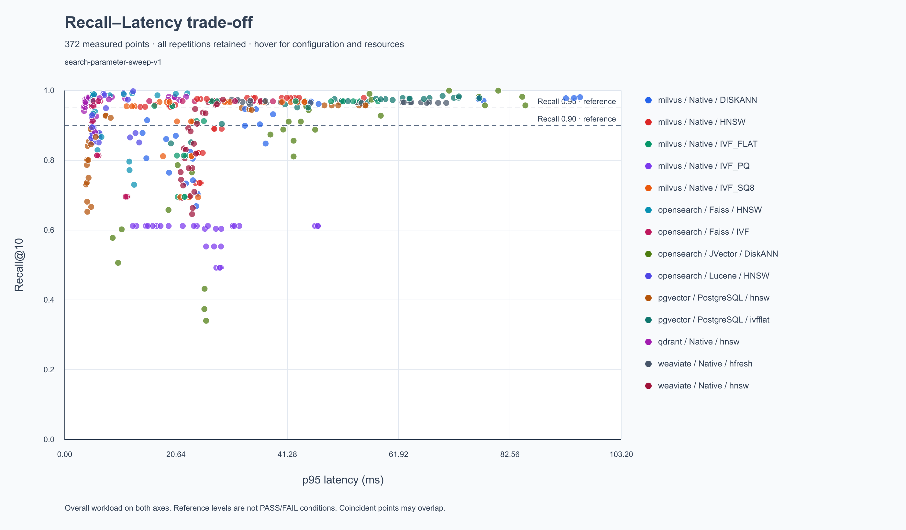

# 전체 검색 파라미터 sweep 실측 결과 — 2026-09-11

새 방식으로 **14개 DB·엔진·인덱스 구성을 각각 3회 재구축하고, 회차마다 124개 검색 파라미터를 전부 측정해 372개 점을 기록**했습니다. 아래 산포도는 이번 실험의 모든 원시 측정값입니다. Recall 0.90과 0.95는 수평 참고선이며, Recall에 따른 탈락·허용 구간·측정값 제거는 없습니다.

[확대 가능한 SVG와 점별 측정 정보](assets/sweep-20260911-220549/scatter-recall-latency-all-372.svg) · [전체 원시 CSV](assets/sweep-20260911-220549/vector-db-result.csv) · [전체 원시 JSON](assets/sweep-20260911-220549/all-measurements.json) · [동일 파라미터 반복 집계](assets/sweep-20260911-220549/vector-db-summary.csv)

## 산포도 읽기

- X축은 전체 evaluation 요청의 p95 latency(ms), Y축은 같은 evaluation의 Recall@10입니다.
- 한 점은 DB + engine + index + 실제 검색 파라미터 + 반복 회차입니다. 세 회차를 평균 점 하나로 바꾸지 않았습니다.
- 색상은 DB·엔진·인덱스를 구분합니다. SVG에서 점에 마우스를 올리면 파라미터, 회차, p50/p95/p99, QPS, CPU·RAM과 측정 시간·자원 표본 수가 표시됩니다.
- 동일 위치의 점은 겹칠 수 있습니다. 저장된 점 수는 372개이며 원시 JSON과 SVG의 Recall·p95 좌표를 대조했습니다.
- 약 0.90 또는 0.95 이상 영역의 실제 점에서 latency와 자원을 함께 비교합니다. 관측하지 않은 Recall 수준을 보간한 값을 실측처럼 사용하지 않습니다.

## 실제 실행 조건

| 항목 | 이번 실행 |
|---|---|
| 실행 ID | sweep-20260911-220549 |
| 시작 / 완료 | 2026-09-11T22:06:19.0966527+09:00 / 2026-09-11T23:47:05.7071797+09:00 |
| 입력 | 합성 청크 10,000개, BGE-M3 dense 1024차원, cosine |
| 검색 | Top-10, concurrency 10 |
| 질의 | SHA-256 층화 분할의 evaluation 200개(무필터 180 + 필터 20); calibration 100개는 추가 진단용 |
| 각 점의 워밍업 | evaluation 200개 1회 |
| 각 점의 측정 | 1,000요청 단위를 최소 5초 이상 반복; 실제 요청 수·시간 저장 |
| 반복 | 14개 구성을 각각 3회 독립 재구축하며 같은 그리드 반복, 총 42번 DB·인덱스 재구축 |
| 순서 | 회차별 DB 순서 교차, 구성 안 검색 파라미터는 오름차순 |
| 자원 제한 | 대상 합계 4 vCPU / 8 GiB / swap 없음; Milvus는 본체·etcd·MinIO 합계 |
| CPU·RAM 수집 | 수집 시작과 종료가 모두 검색 구간 안인 Docker 표본만 집계 |
| 정답 | 같은 입력·필터의 exact cosine Top-K; 정답이 빈 필터 6개를 제외한 194개가 질의 집합 1회당 Recall 평균 대상이며 200개 모두의 latency·QPS를 측정 |

CPU 100%는 한 코어 사용량에 해당합니다. 자원 평균·최댓값은 해당 검색 구간의 수집 표본에 대한 값입니다. QPS는 실제 완료한 전체 요청 수를 검색 구간으로 나눈 값이며, 최소 5초를 채우기 위해 요청 수가 파라미터별로 다를 수 있습니다.

## 구성별 측정 범위

다음 범위는 **검색 폭 전체와 세 회차를 포함한 관측 범위**입니다. 동일 파라미터의 반복 변동은 별도 집계를 확인합니다.

| ID | DB / Engine / Index | 실제 검색 파라미터 그리드 | 점 수 | Recall@10 최소–최대 | p95 ms 최소–최대 |
|---|---|---|---:|---:|---:|
| T01 | pgvector / PostgreSQL / HNSW | ef_search: 10, 20, 40, 80, 120, 200, 400, 800, 1000 | 27 | 0.652577–0.957216 | 3.964–55.776 |
| T03 | pgvector / PostgreSQL / IVFFlat | probes: 1, 2, 3, 4, 5, 6, 8, 10 | 24 | 0.848454–0.984536 | 19.695–76.895 |
| T05 | qdrant / Native / HNSW | hnsw_ef: 10, 20, 40, 80, 120, 200, 400, 800, 1000 | 27 | 0.880928–0.983505 | 3.566–22.513 |
| T07 | weaviate / Native / HNSW | ef: 10, 20, 40, 80, 120, 200, 400, 800, 1000 | 27 | 0.645876–0.973711 | 21.497–29.331 |
| T09 | weaviate / Native / HFresh | searchProbe: 8, 16, 32, 64, 128, 256, 512, 1024 | 24 | 0.959519–0.973711 | 30.945–70.745 |
| T11 | milvus / Native / HNSW | ef: 10, 20, 40, 80, 120, 200, 400, 800, 1000 | 27 | 0.735052–0.978866 | 14.043–55.453 |
| T13 | milvus / Native / IVF_FLAT | nprobe: 1, 2, 4, 8, 16, 32, 64, 96, 128 | 27 | 0.695361–0.969072 | 16.625–58.127 |
| T15 | milvus / Native / IVF_SQ8 | nprobe: 1, 2, 4, 8, 16, 32, 64, 96, 128 | 27 | 0.694330–0.967010 | 11.480–44.461 |
| T17 | milvus / Native / IVF_PQ | nprobe: 1, 2, 4, 8, 16, 32, 64, 96, 128 | 27 | 0.492268–0.611856 | 12.644–46.946 |
| T19 | milvus / Native / DISKANN | search_list: 10, 20, 40, 80, 120, 200, 400, 800, 1000 | 27 | 0.668557–0.980928 | 14.431–95.559 |
| T21 | opensearch / Lucene / HNSW | candidate_k: 10, 20, 40, 80, 120, 200, 400, 800, 1000 | 27 | 0.851031–0.997938 | 4.948–13.822 |
| T23 | opensearch / Faiss / HNSW | ef_search: 10, 20, 40, 80, 120, 200, 400, 800, 1000 | 27 | 0.729897–0.991753 | 5.043–22.742 |
| T25 | opensearch / Faiss / IVF | nprobes: 1, 2, 4, 8, 16, 32, 64, 96, 128 | 27 | 0.695361–0.969588 | 4.994–38.609 |
| T27 | opensearch / JVector / DiskANN | candidate_k: 10, 20, 40, 80, 120, 200, 400, 800, 1000 | 27 | 0.340206–0.999485 | 8.897–85.424 |

## 실측으로 읽는 품질·성능 관계

다음은 산포도를 읽기 위한 **고정 파라미터별 3회 측정 예시**입니다. Recall은 최소–최대, p95는 중앙값(최소–최대)을 표시합니다. QPS·평균 CPU·평균 RAM 열은 각 회차 지표의 중앙값입니다. 각 열의 중앙값이 하나의 실제 실행을 뜻하지 않으며, 이 표의 요약값은 산포도 점으로 추가하지 않습니다.

| 구성 / 고정 검색 파라미터 | Recall@10 범위 | p95 중앙값 ms (범위) | QPS 중앙값 | 평균 CPU의 중앙값 % | 평균 RAM의 중앙값 MiB |
|---|---:|---:|---:|---:|---:|
| T05 / hnsw_ef=20 | 0.941237–0.961340 | 3.789 (3.596–3.869) | 3705.6 | 364.55 | 107.25 |
| T05 / hnsw_ef=120 | 0.977320–0.983505 | 4.446 (4.322–5.504) | 3084.2 | 392.02 | 103.05 |
| T05 / hnsw_ef=1000 | 0.972680–0.981959 | 21.255 (20.444–22.513) | 1232.6 | 391.92 | 102.45 |
| T09 / searchProbe=8 | 0.959519–0.973711 | 31.883 (30.945–34.387) | 554.9 | 383.68 | 111.15 |
| T09 / searchProbe=1024 | 0.964433–0.965979 | 64.263 (64.093–70.745) | 281.0 | 381.95 | 179.80 |
| T13 / nprobe=8 | 0.955670–0.955670 | 19.955 (16.625–20.012) | 1639.2 | 296.13 | 593.28 |
| T17 / nprobe=8 | 0.611856–0.611856 | 13.282 (12.644–17.770) | 1739.3 | 295.09 | 622.43 |
| T27 / candidate_k=1000 | 0.957216–0.999485 | 84.845 (80.401–85.424) | 201.8 | 395.07 | 4809.73 |

- **검색 폭 증가의 비용:** Qdrant T05의 `hnsw_ef=120→1000`은 Recall 범위가 겹치지만 p95 중앙값은 4.446→21.255ms, QPS 중앙값은 3,084.2→1,232.6입니다. 이 데이터에서는 더 큰 탐색 폭의 비용과 추가 품질을 함께 따져야 합니다.
- **참고선을 걸치는 반복:** T05 `hnsw_ef=20`의 Recall은 1·2·3회차에서 각각 0.941237, 0.952062, 0.961340입니다. 세 점을 모두 보존합니다. 중앙값이 0.95보다 높다는 사실은 모든 회차의 검색 품질을 보장하지 않습니다.
- **높은 품질에서 시작하는 구성:** HFresh T09는 이번 24개 점 모두 Recall 0.95보다 높았습니다. `searchProbe=8→1024`에서 p95 중앙값은 31.883→64.263ms로 늘었고 Recall 범위는 겹칩니다. 0.90에 맞추기 위해 구성을 제거하거나 품질을 낮출 이유가 없습니다.
- **낮은 품질도 전체 분석의 일부:** Milvus IVF_PQ T17의 전체 27개 점은 Recall 0.492268–0.611856입니다. `nprobe=8`의 IVF_FLAT보다 빠른 p95만 보고 동등한 검색 품질의 우위로 해석하지 않습니다. 27개 점은 전체 산포도에 그대로 남습니다.
- **재구축 변동:** JVector T27의 같은 `candidate_k=1000`도 Recall 0.957216–0.999485로 달랐습니다. 이 차이를 보정하거나 특정 회차만 골라 결과를 만들지 않습니다.

위 설명은 이번 10k 입력·고정 부하·현재 어댑터의 관측입니다. 원인별 프로파일링이나 다른 생성 파라미터 실험은 수행하지 않았으므로 GraphQL·양자화·인덱스 알고리즘 중 하나만이 차이의 원인이라고 단정하지 않습니다. 전체 124개 파라미터 그룹은 [집계 JSON](assets/sweep-20260911-220549/vector-db-summary.json)에서 확인할 수 있습니다.

## 보존과 검증

- 계획한 372개 조합·파라미터·회차가 각각 한 번씩 기록됐고, 같은 파라미터의 집계는 124개 그룹 × 3회입니다.
- 원시 JSON 372개 측정과 산포도 372개 점의 Recall·p95 수치가 일치합니다. 품질 참고선은 2개입니다.
- 모든 원시 측정의 문서 벡터·질의 벡터·질의 정의 SHA-256이 실행 명세와 일치합니다.
- 실행 오류 0건, CPU 수집 누락 0개, RAM 수집 누락 0개, 빈 정답 반환 위반 0건입니다.
- 가장 짧은 검색 측정은 5001ms, 점당 자원 표본은 최소 2개입니다. 전체 측정 요청은 2,948,000회입니다(워밍업·추가 진단 제외).
- [검증 결과](assets/sweep-20260911-220549/validation.json), [실행 명세와 입력·JAR 해시](assets/sweep-20260911-220549/run-manifest.json), [실제 실행 순서](assets/sweep-20260911-220549/execution-order.json), [고정 산출물 해시](assets/sweep-20260911-220549/artifact-hashes.json)를 보존했습니다.
- [실행 소스·설정 사본](assets/sweep-20260911-220549/source-snapshot.zip)과 [실행 전 자동 테스트 42개 통과 기록](assets/sweep-20260911-220549/unit-test-results.json)도 함께 보존했습니다.
- 로컬 원시 파일·로그·검증 스크립트는 저장소의 benchmark-result/sweep-20260911-220549/에 있습니다.

동일 파라미터의 [집계 JSON](assets/sweep-20260911-220549/vector-db-summary.json)은 Recall, latency, QPS, CPU, RAM 등의 평균·median·p95/p99·최소·최대·표본분산을 제공합니다. 집계 p95/p99는 **세 반복 측정 지표 사이**의 분위수이며, 한 점의 요청별 p95/p99와 다릅니다.

## 실험 범위와 이전 시도

이 결과는 10k 합성 데이터와 현재 검색 클라이언트·동시성 조건의 관측입니다. 검색 파라미터를 오름차순으로 실행했고 워밍업을 200요청으로 고정했으므로 실행 순서·캐시·JIT 영향을 완전히 분리한 실험은 아닙니다. 세 번의 재구축만으로 넓은 신뢰구간이나 운영 규모의 순위를 확정하지 않습니다. 별도 100k/1M, 실제 FAQ·질의, 필터 선택도별 부하 결과는 포함하지 않았습니다.

최초 시도 sweep-20260911-215805의 26개 측정은 검색 종료 뒤 유휴 CPU 표본이 섞이는 계측 문제를 발견해 중단했습니다. 해당 원시값과 중단 사유는 별도 디렉터리에 보존했습니다. 이번 372개는 최소 5초 측정과 검색 구간 내부 표본 수집을 적용해 처음부터 다시 실행한 결과입니다. 이전 시도와 이번 결과는 계측 조건이 달라 합치지 않았습니다.

[과거 목표별 파라미터 선택 방식의 84개 결과](matrix-results-20260911.md)도 역사 자료로 유지합니다. 이번 산포도에는 새 실험의 372개 측정만 사용했습니다.
